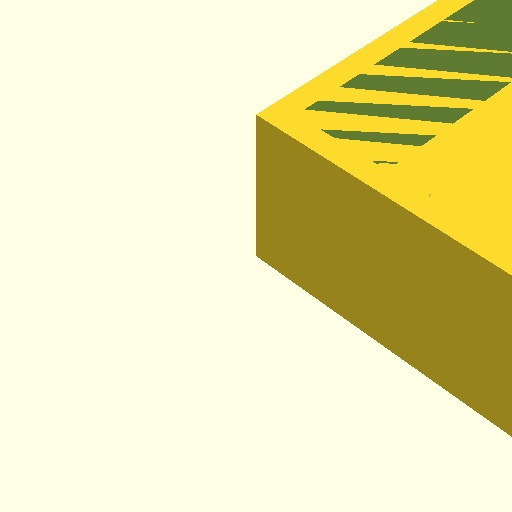
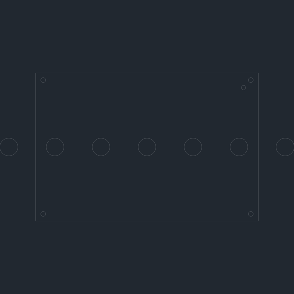
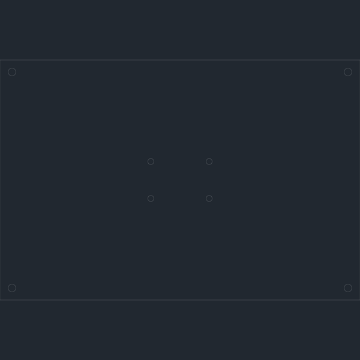

# ESP32-S3 Dual-Mode HID Device with Footswitches

This project transforms an ESP32-S3 microcontroller into a versatile Human Interface Device (HID) that functions as both a keyboard and a mouse. It supports both Bluetooth Low Energy (BLE) and USB connectivity. Additionally, it features physical footswitch inputs and a 3D printable/laser-cut case.

## Features

*   **Dual-Mode Connectivity:** Acts as a HID keyboard and mouse over both Bluetooth LE and USB.
*   **Physical Inputs:** Supports 7 programmable footswitches (Enter, ESC, Page Up, Page Down, and 3 customizable macros).
*   **Debouncing:** Implements software debouncing for reliable button presses.
*   **Boot Indicator:** Flashes the onboard LED on successful boot.
*   **Composite USB Device:** Exposes both HID and CDC (Serial) interfaces over USB for debugging and communication.
*   **3D Printable Case:** Custom-designed multi-piece case for easy assembly.
*   **Laser-Cut Case:** Design files for a laser-cut acrylic case.

## Hardware

*   **ESP32-S3 Board:** Specifically designed for the LOLIN S3 Mini.
*   **Footswitches:** Standard momentary footswitches (connect between GPIO and GND).

## Software Setup

This project uses PlatformIO for development.

1.  **Install PlatformIO Core:** If you don't have PlatformIO installed, follow the instructions on the [PlatformIO website](https://platformio.org/install/cli).
    *   It's recommended to install PlatformIO using `pipx` to avoid conflicts with your system's Python:
        ```bash
        pipx install platformio
        ```

2.  **Clone the Repository:**
    ```bash
    git clone git@github.com:Rubiaceae65/esp-hid.git
    cd esp-hid
    ```

3.  **Initialize Submodules:**
    ```bash
    git submodule update --init --recursive
    ```

4.  **Build the Project:**
    ```bash
    pio run
    ```

5.  **Upload to ESP32-S3:**
    *   Connect your LOLIN S3 Mini board to your computer via USB.
    *   Put the board into bootloader mode (if necessary: hold BOOT, press and release RESET, then release BOOT).
    *   Upload the firmware:
        ```bash
        pio run --target upload
        ```

6.  **Serial Monitor:**
    *   To view debug messages and button presses, open the serial monitor:
        ```bash
        pio device monitor
        ```

## Case Designs

This project includes designs for both 3D printable and laser-cut cases.

### Generating Case Models

To generate the case models, you need Python and the `solidpython` and `ezdxf` libraries. It's recommended to use a Python virtual environment.

1.  **Create and Activate Virtual Environment:**
    ```bash
    python3 -m venv venv
    source venv/bin/activate # On Linux/macOS
    # venv\Scripts\activate.bat # On Windows (Command Prompt)
    # venv\Scripts\Activate.ps1 # On Windows (PowerShell)
    ```

2.  **Install Required Libraries:**
    ```bash
    pip install solidpython ezdxf
    ```

3.  **Generate 3D Printable Case (OpenSCAD):**
    ```bash
    ./venv/bin/python generate_case.py
    ```
    This will create `esp32_footswitch_case_base.scad` and `esp32_footswitch_case_lid.scad` in the project root.

4.  **Generate Laser-Cut Case (DXF):**
    ```bash
    ./venv/bin/python generate_lasercut_case.py
    ```
    This will create `esp32_lasercut_case_top.dxf`, `esp32_lasercut_case_bottom.dxf`, `esp32_lasercut_case_front_back.dxf`, and `esp32_lasercut_case_left_right.dxf` in the project root.

### Viewing and Exporting Case Models

#### 3D Printable Case

1.  **Install OpenSCAD:** Download from [https://openscad.org/downloads.html](https://openscad.org/downloads.html).
2.  **Open `.scad` files:** Open `esp32_footswitch_case_base.scad` and `esp32_footswitch_case_lid.scad` in OpenSCAD.
3.  **Customize (Optional):** Adjust parameters within `generate_case.py` and regenerate, or make minor edits directly in OpenSCAD.
4.  **Export to STL:** In OpenSCAD, go to `File > Export > Export as STL...` for each part.

#### Laser-Cut Case

1.  **Open DXF files:** Use a CAD software that supports DXF (e.g., Inkscape, AutoCAD, Adobe Illustrator, or your laser cutter's software).
2.  **Customize (Optional):** Adjust parameters within `generate_lasercut_case.py` and regenerate, or make minor edits directly in your CAD software.

### Renderings for README

To generate PNG renderings of all case parts for display in this README, run the following script:

```bash
./venv/bin/python render_cases.py
```

**3D Printable Case Renderings:**




**Laser-Cut Case Renderings:**





## Usage

*   **USB Connection:** Plug the ESP32-S3 into your computer. It will be recognized as a keyboard and mouse.
*   **Bluetooth LE Connection:** Search for "ESP32-S3 Keyboard" on your device and pair.
*   **Physical Buttons:**
    *   **GPIO 4:** Enter Key
    *   **GPIO 5:** ESC Key
    *   **GPIO 6:** Page Up
    *   **GPIO 7:** Page Down
    *   **GPIO 8:** Types "Macro 1 Output"
    *   **GPIO 9:** Types "Macro 2 Output"
    *   **GPIO 10:** Types "Macro 3 Output"

    Connect momentary push buttons between these GPIO pins and GND. Internal pull-up resistors are enabled.

## Troubleshooting

*   **Serial Port Issues (Linux):** If you encounter "Permission denied" or "Inappropriate ioctl for device" errors when uploading or monitoring, ensure you have installed the `99-platformio-udev.rules` as described in the [PlatformIO documentation](https://docs.platformio.org/en/latest/core/installation/udev-rules.html).
*   **Upload Failures:** Ensure your ESP32-S3 is in bootloader mode during upload (hold BOOT, press and release RESET, then release BOOT).